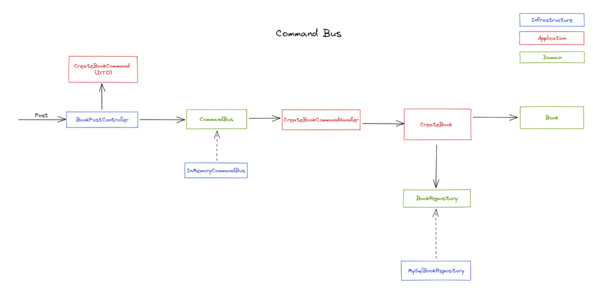
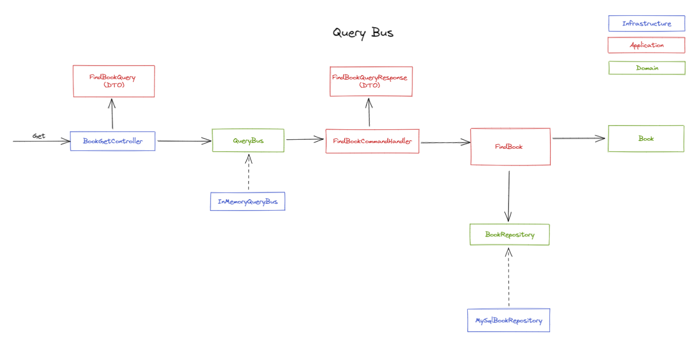

# CQRS

Understanding implemented CQRS

## Install

```
npm install
```

## Launch

```
ts-node src/commandBusExample/apps/book/app.ts
```

```
ts-node src/queryBusExample/apps/book/app.ts
```

## Command Bus



### BookPostController

- Layer: infrastructure
- Responsibilities: 
    - Receive post request
    - Recover the data from request
    - Create command with the data
    - Send command to the bus

### CreateBookCommand

- Layer: application
- Responsibilities:
    - Encapsulate the creation book data

### CommandBus

- Layer: domain(interface)
- Responsibilities:
    - Transport commands to corresponding handler

### InMemoryCommandBus

- Layer: application
- Responsibilities:
    - Receive a command from bus
    - Transform command data into value object

### CreateBookCommandHandler

- Layer: infrastructure
- Responsibilities:
    - CommandBus implementation

### CreateBook

- Layer: application
- Responsibilities:
    - Encapsulate business logic
    
### Book

- Layer: domain
- Responsibilities:
    - Represent a domain concept

### BookRepository

- Layer: domain(interface)
- Responsibilities:
    - Domain contract with persistence layer

### MysqlBookRepository

- Layer: infrastructure
- Responsibilities:
    - Implementation of domain contract repository

## Query Bus




### BookGetController

- Layer: infrastructure
- Responsibilities:
    - Receive get request
    - Recover the data from request
    - Create query with the data
    - Send query to the bus

### FindBookQuery

- Layer: application
- Responsibilities:
    - Encapsulate the find book data

### QueryBus

- Layer: domain(interface)
- Responsibilities:
    - Transport query to corresponding handler

### InMemoryQueryBus

- Layer: application
- Responsibilities:
    - Receive a query from bus
    - Transform query data into value object

### CreateBookQueryHandler

- Layer: infrastructure
- Responsibilities:
    - QueryBus implementation

### FindBookQueryResponse

- Layer: application
- Responsibilities:
    - Encapsulate response data as primitives

### FindBook

- Layer: application
- Responsibilities:
    - Encapsulate business logic

### Book

- Layer: domain
- Responsibilities:
    - Represent a domain concept

### BookRepository

- Layer: domain(interface)
- Responsibilities:
    - Domain contract with persistence layer

### MysqlBookRepository

- Layer: infrastructure
- Responsibilities:
    - Implementation of domain contract repository


[TS Boilerplate](https://github.com/ulisesantana/ts-boilerplate)
